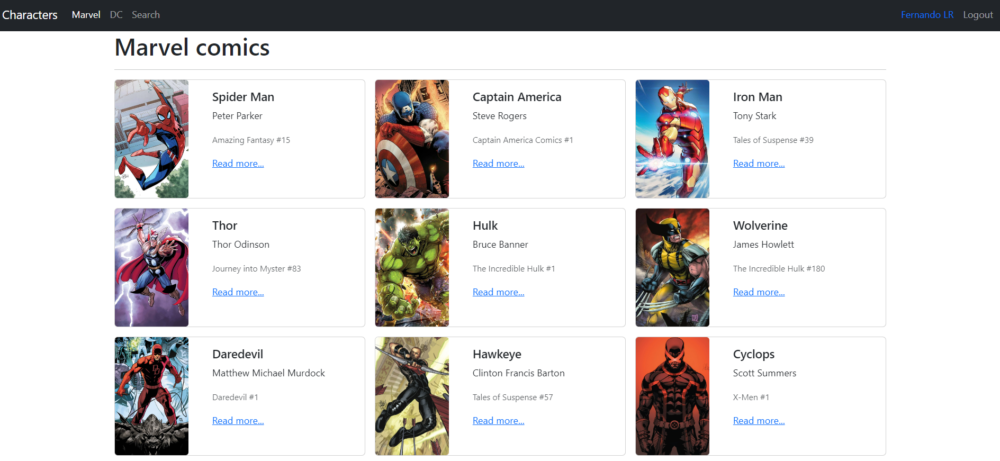
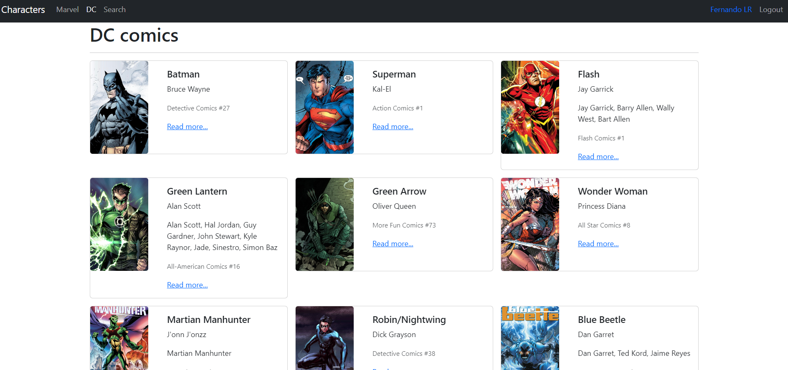
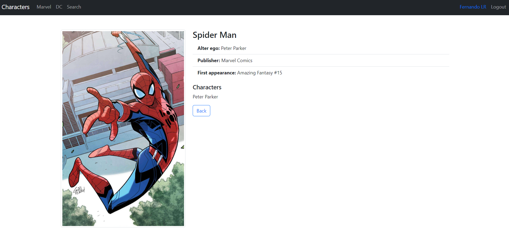
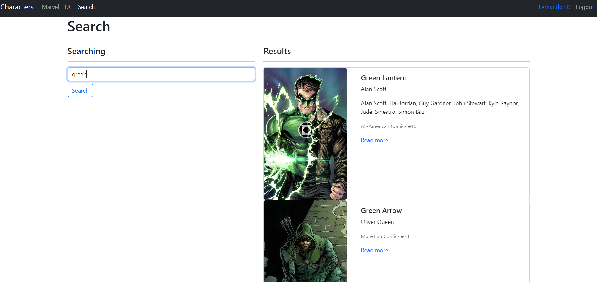

#   Heroes filter
Heroes filter web app built with React.

## Installation
1. Clone the repository
```bash
git clone https://github.com/Fernando-LRz/heroes-filter.git
``` 
2. Navigate to the project directory
```bash
cd heroes-filter
```
3. Install dependencies
```bash
npm install
```

## Run
```bash
npm run dev
```

## Images
| Marvel heroes                                                    |
| ---------------------------------------------------------------- |
|    |

| DC heroes                                                        |
| ---------------------------------------------------------------- |
|        |

| Hero                                                             |
| ---------------------------------------------------------------- |
|             |

| Heroes search                                                    |
| ---------------------------------------------------------------- |
|           |
